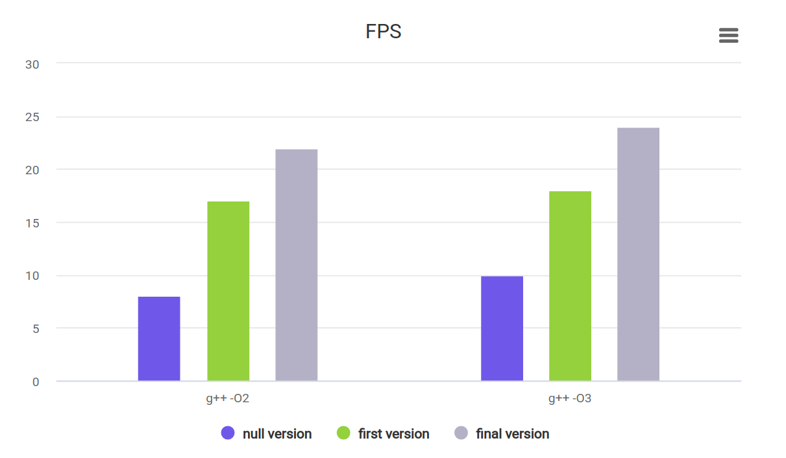

# Mandelbrot Set Optimization Project

## Table of Contents

1. [Description](#description)
2. [Execution speed](#execution-speed)
   - [CPU ticks (compiler & prog versions)](#cpu-ticks-compiler--prog-versions)
   - [FPS (compiler & prog versions)](#fps-compiler--prog-versions)
3. [AVX acceleration](#avx-acceleration)
   - [Intel AVX functions used in the project](#intel-avx-functions-used-in-the-project)

## Description

The Mandelbrot project was created to show how much you can influence code optimization with the  
help of different optimizations, in particular, vectorization is realized here.  
The project consists of three parts:  

1. A [null_version](source/functions_basic_version.cpp) of Mandelbrot set drawing.
2. The [first version](source/functions_array_version.cpp) of the vectorization implementation by adding arrays of size 4x1.
5. The [final version](source/functions_proc_instructions.cpp) of the vectorization implementation with real  
intrinsics library `<immintrin.h>`.

## Execution speed

### CPU ticks (compiler & prog versions)

Table shows `CPU ticks * 10^6` for each version of the program with different compilators.

| Compiler Flags       | Null Version  | First Version   | Vectorized (`real AVX`) |
|----------------------|---------------|--------------   |-------------------------|
| `g++ -O2`           | 326.45 +- 5.68 | 180.63 +- 5.23  | 116.93 +- 2.37          |
| `g++ -O3`           | 324.59 +- 2.11 | 155.88 +- 3.63  | 119.58 +- 5.39          |

### FPS (compiler & prog versions)

> [!NOTE]
> The speed of the program is measured in fps (frames per second).

Distribution: `Linux Mint`  
CPU: `Intel Core i7 13700H (2,4 ГГц)`  

| Compiler Flags       | Naive Version | First Version | Vectorized (`no real AVX`, `4×1`) | Vectorized (`no real AVX`, `7×1`) | Vectorized (`real AVX`) |
|----------------------|---------------|---------------|----------------------------------|----------------------------------|------------------------|
| `g++ -O2`           | 22-23         | 39            | 52-53                            | 17                               | 59-60                  |
| `g++ -O3`           | 23            | 50-51         | 47-48                            | 42                               | 60-61                  |

## AVX acceleration

AVX (Advanced Vector Extensions) is a set of instructions for x86/x86-64 processors that enables parallel computations on multiple data points simultaneously (SIMD — Single Instruction, Multiple Data). In this program, AVX is utilized to accelerate Mandelbrot set calculations by processing 4 `double` values in a single operation.

### Intel AVX functions used in the project

> [!Note]
> You need the `-mavx` flag to make it work.

The table below lists the main AVX functions employed in the code:

| AVX Function Name          | AVX Function Parameters                      | Return Value            | Brief Description of What It Does                     |
|----------------------------|---------------------------------------------|-------------------------|-------------------------------------------------------|
| `_mm256_loadu_pd`          | `const double* ptr`                         | `__m256d`               | Loads 4 `double` values from memory into an AVX register |
| `_mm256_set1_pd`           | `double a`                                  | `__m256d`               | Creates an AVX register with 4 copies of a single value |
| `_mm256_mul_pd`            | `__m256d a, __m256d b`                      | `__m256d`               | Multiplies 4 pairs of `double` values element-wise    |
| `_mm256_add_pd`            | `__m256d a, __m256d b`                      | `__m256d`               | Adds 4 pairs of `double` values element-wise          |
| `_mm256_sub_pd`            | `__m256d a, __m256d b`                      | `__m256d`               | Subtracts 4 pairs of `double` values element-wise     |
| `_mm256_cmp_pd`            | `__m256d a, __m256d b, int imm8`            | `__m256d`               | Compares 4 pairs of `double` values (here, <=)        |
| `_mm256_movemask_pd`       | `__m256d a`                                 | `scalar bit mask (int)` | Converts comparison results into a bit mask           |
| `_mm_loadu_si128`          | `__m128i const* mem_addr`                   | `__m128i`               | Loads 4 `int` values into an SSE register             |
| `_mm_add_epi32`            | `__m128i a, __m128i b`                      | `__m128i`               | Adds 4 pairs of `int` values element-wise             |
| `_mm_storeu_si128`         | `__m128i* mem_addr, __m128i a`              | `void`                  | Stores 4 `int` values from a register into memory     |

- __m256d for 256-bit AVX registers holding 4 double values.  
- __m128i for 128-bit SSE registers holding 4 int values.  

These functions enable simultaneous computation on 4 points of the Mandelbrot set, significantly improving performance compared to sequential operations.
